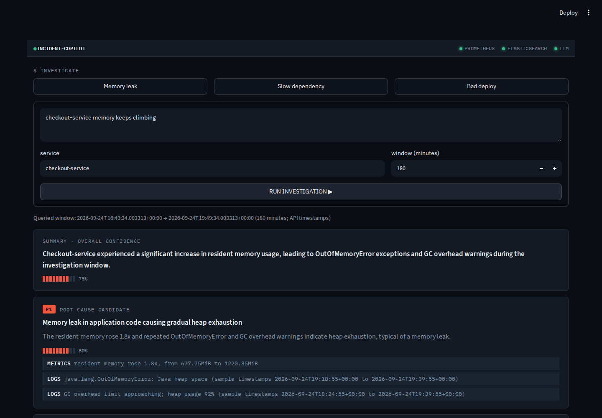
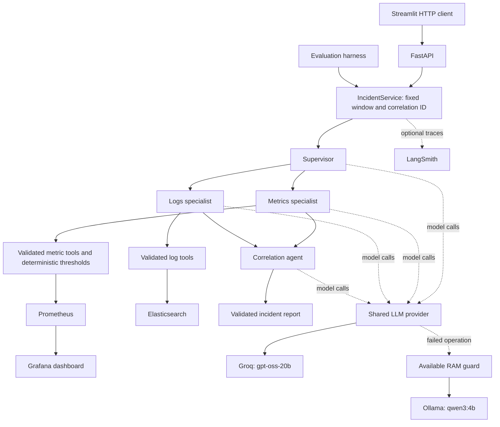
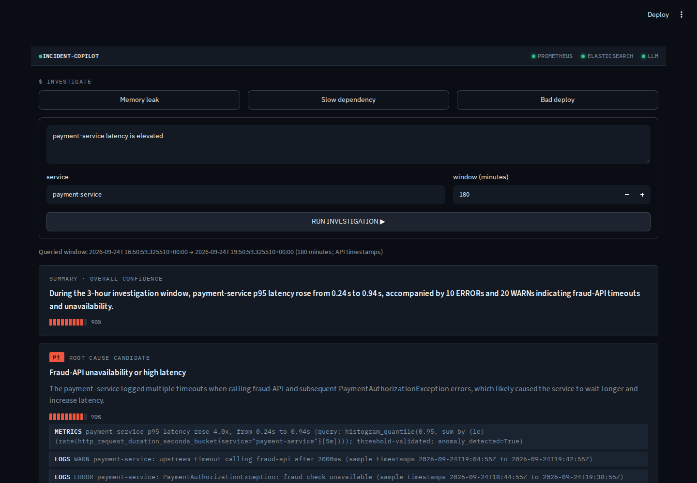
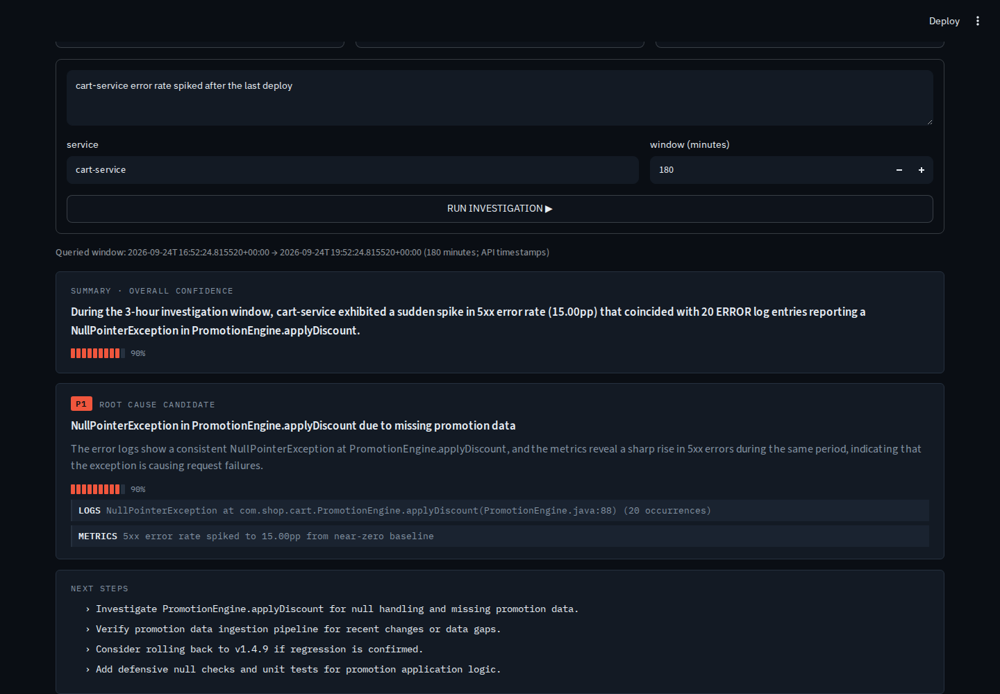

# Incident Response Copilot

An agentic AI system that helps engineers investigate production incidents faster. It turns a service symptom into a structured
report using Prometheus metrics and Elasticsearch logs. A LangGraph supervisor
routes work to metrics and logs specialists; a correlation agent proposes ranked
causes, cites observations, and suggests follow-up checks. Engineers can investigate
through a FastAPI endpoint or a Streamlit console.

**Groq `openai/gpt-oss-20b` is the default model**, with automatic Ollama `qwen3:4b`
fallback. The cloud path, Docker stack, tracing, and all three UI scenarios have
retained validation evidence. Successful local inference is blocked by available
RAM on the demo laptop. The latest repeated evaluation scored **4/9 culprit-service
mentions, not proven root-cause accuracy**. See [Measured results](#measured-results).

[Watch/download the 55-second recorded demo](docs/media/streamlit-demo.mp4)



## Build and run

Prerequisites: Python **3.12+**, [uv](https://docs.astral.sh/uv/), Docker Engine with
Compose, and a Groq API key. Commands below run from the repository root. Docker services plus the UI and browser need headroom beyond the
container memory measurements below.

```bash
cp .env.example .env
# Edit .env and set GROQ_API_KEY. Leave LANGSMITH_TRACING=false for this walkthrough.

uv venv .venv
uv pip install --python .venv/bin/python -e '.[dev,ui]'

make docker-app-up   # build FastAPI and start all five services
make seed            # load fresh synthetic metrics/logs; restart Prometheus
curl --fail http://localhost:8000/health
make streamlit       # host UI on http://localhost:8501
```

Wait until `/health` reports Prometheus, Elasticsearch, and LLM reachable before
submitting an investigation. If the API is still starting, repeat the health check.
The UI runs on the host; FastAPI and the four supporting services run in Docker.
Docker receives `.env` configuration at container creation, so rerun
`make docker-app-up` after changing it.

| Service | Local URL | Purpose |
|---|---|---|
| Streamlit | http://localhost:8501 | Investigation form and report cards |
| FastAPI | http://localhost:8000/docs | Interactive API documentation |
| Prometheus | http://localhost:9090 | Seeded time series and PromQL |
| Grafana | http://localhost:3000 | Provisioned Incident Overview dashboard |
| Elasticsearch | http://localhost:9200 | Synthetic application logs |
| Ollama | http://localhost:11434 | Optional local fallback server |

Choose **Memory leak**, **Slow dependency**, or **Bad deploy**, then click
**RUN INVESTIGATION**. Each example selects its target service and a 180-minute
window. Reports display the API's authoritative start/end timestamps, a summary,
ranked candidates, evidence, model confidence, and next steps. P1/P2/P3 indicate
candidate rank, not measured incident severity. Confidence is not calibrated.

Allow roughly 65 seconds between live demo investigations to reduce quota pressure;
this does not guarantee quota availability. Health checks establish connectivity
and model availability, not sufficient inference memory or remaining cloud quota.

Seed shortly before a demo: investigations query a window ending **now**, while
seeded history stays fixed. `make seed` replaces the synthetic log index and adds
fresh metric blocks. For a clean demo reset, `make demo-reset` replaces generated
data and starts the supporting services; follow it with `make docker-app-up` to
restore the API. These commands affect this project's demo data.

Stop the UI with Ctrl+C and the Docker stack with `make docker-down`. The Ollama
model volume survives normal shutdown. `make ollama-pull` downloads `qwen3:4b` when
local inference is needed; a download does not establish sufficient runtime RAM.
The demo uses unauthenticated Elasticsearch and anonymous Grafana viewing and is
intended for local synthetic data.

### API usage

```bash
curl --fail-with-body http://localhost:8000/api/v1/investigations \
  -H 'Content-Type: application/json' \
  -d '{"query":"checkout-service memory keeps climbing","service":"checkout-service","minutes_back":180}'
```

The response contains `summary`, `likely_causes` (title, rationale, confidence,
supporting evidence), `next_steps`, `confidence`, and `investigation_window`.
[An actual captured response](docs/validation/2026-09-24-streamlit/browser/memory_leak.json)
is retained with its request, status, and timing. The window metadata comes from
the service, independently of model-written prose. `service` is optional and
`minutes_back` accepts 1–1440. Invalid requests return HTTP 422; an investigation
that cannot produce a report returns HTTP 503.

To run FastAPI on the host instead of in Docker, start the supporting services with
`make docker-up`, seed, and use `make serve`. Port 8000 must be free. Set
`INCIDENT_COPILOT_API_URL` in the UI process environment to use a different API:

```bash
INCIDENT_COPILOT_API_URL=http://localhost:8000 make streamlit
```

## Seeded scenarios

`make seed` generates three hours of aligned metrics and logs. Metrics are backfilled
as TSDB blocks using `promtool`; Elasticsearch receives 1,231 log documents in the
validated default seed. Grafana exposes latency, error ratio, memory, and CPU.

| Scenario | Investigation target | Seeded culprit | Observations |
|---|---|---|---|
| Memory leak | `checkout-service` | `checkout-service` | Memory climbs, restarts reset it, OOM/GC logs appear |
| Slow dependency | `payment-service` | `fraud-api` | Dependency latency rises before the caller; timeout warnings |
| Bad deploy | `cart-service` | `cart-service` | 5xx rises to about 15% around version `v1.4.2` → `v1.5.0` |

These are known synthetic scenarios, not production incidents. The presence of a
seeded causal pattern does not establish that a generated report recovered it.

## System design



The graph is acyclic: supervisor → selected specialists → correlation. Specialists
can run concurrently, and each has bounded tool rounds. Tools validate arguments
and call connector interfaces; agents do not access raw data clients directly.
The requested interval travels through runtime tool configuration, so a model's
chosen duration cannot override it.

Curated metric analysis computes trends and thresholds deterministically before the
model interprets them. Raw PromQL findings are marked as not threshold-validated.
Correlation receives both specialists' findings, collection errors, and the exact
window. Pydantic validates the report shape and ranks nonempty, evidenced causes;
it does **not** verify that cited evidence proves a diagnosis.

### Technology stack

| Layer | Technology |
|---|---|
| Language and packaging | Python 3.12+, uv, Hatchling |
| Orchestration | LangGraph, LangChain Core |
| API and validation | FastAPI, Pydantic v2, pydantic-settings |
| Model adapters | langchain-groq, langchain-ollama; common provider interface |
| Data and dashboards | Prometheus, Elasticsearch 8.13, Grafana |
| UI | Streamlit, HTTPX |
| Observability | structlog, optional LangSmith |
| Quality checks | pytest, Ruff, Black, strict mypy |
| Deployment and demo capture | Docker Compose; Playwright and FFmpeg for validation/media |

### Package structure

```text
src/incident_copilot/
├── config/           # environment-driven settings
├── models/           # reports, findings, metrics, logs, windows
├── analysis/         # deterministic trends and evidence rendering
├── connectors/       # Prometheus and Elasticsearch adapters
├── tools/            # validated tools and fixed-window propagation
├── llm/              # Groq, Ollama, fallback, fake provider, JSON repair
├── agents/           # supervisor, specialists, correlation, compiled graph
├── services/         # investigation use case and authoritative metadata
├── api/              # HTTP schemas, health and investigation routes
├── demo/             # scenario curves and synthetic data rendering
├── evaluation/       # scenario harness and service-mention scorer
├── utils/            # tracing, logging, exceptions
├── composition.py    # shared construction for API and evaluation
└── main.py           # FastAPI entry point
streamlit_app/        # independent HTTP client, page, styles
scripts/              # seeding and retained validation recorders
tests/unit/           # offline tests with fake/stub dependencies
tests/integration/    # live stack and deployed API checks
docker/               # service configuration and Grafana provisioning
docs/validation/      # reports, measurements, commands, screenshots
```

## Configuration and failure behavior

[`.env.example`](.env.example) lists the supported application settings. Never put
keys in tracked source. The default configuration is:

| Setting | Default |
|---|---|
| `LLM_PROVIDER` | `groq` |
| `GROQ_MODEL` | `openai/gpt-oss-20b` |
| `GROQ_TIMEOUT_SECONDS` | `30` |
| `LLM_FALLBACK_PROVIDER` | `ollama` (`none` disables fallback) |
| `OLLAMA_MODEL` | `qwen3:4b` |
| `OLLAMA_TIMEOUT_SECONDS` | `60`, including queueing |
| `OLLAMA_NUM_CTX` | `4096` |
| `OLLAMA_MIN_AVAILABLE_MEMORY_MB` | `4096` before a cold load |
| `MAX_TOOL_ROUNDS` | `2` per specialist |
| `LANGSMITH_TRACING` | `false` |

A missing Groq key fails configuration early. Groq API errors (including 401/429),
connection failures, timeouts, and exhausted JSON repairs trigger local fallback.
Tool history is preserved; each new model operation tries Groq first. Groq SDK
retries are disabled. Ollama access is serialized, thinking is disabled, output is
bounded, and keep-alive is one minute. An already loaded model requires 1,024 MiB
available RAM; a cold model requires 4,096 MiB. These checks do not reserve memory
or guarantee against OOM. `LLM_PROVIDER=ollama` selects local inference directly.

For a remote Ollama host, set its URL and manage memory there; the local RAM check
can be disabled with `OLLAMA_MIN_AVAILABLE_MEMORY_MB=0` in that configuration.
The laptop's RAM guard remains enabled. If neither provider can produce a report,
the API returns 503 and the UI displays the error.

Provider deadlines apply to individual operations. The UI has a **300-second HTTPX
network-inactivity timeout**, not a total server deadline. A timed-out investigation
may still run on the server. The UI handles disconnected APIs, JSON and non-JSON
errors, malformed reports, and health-response failures.

To enable tracing, set `LANGSMITH_TRACING=true`, `LANGSMITH_API_KEY`, and optionally
`LANGSMITH_PROJECT`; restart the application. Both modern and legacy SDK flags are
configured together. Tracing configuration is process-wide, not a per-request
switch. Disabled operation was tested without a tracing key in settings, including
inherited enabled SDK flags.

## Measured results

### Repeated evaluation: 2026-09-23

**Method:** three attempts per scenario using host `IncidentService` calls against
real Groq `openai/gpt-oss-20b` and Docker data sources, tracing disabled, temperature
0, a 180-minute window, and 65-second pacing. All nine attempts are retained,
including the failure. The scorer searches the **first cause's title, rationale,
and evidence** for a case-insensitive expected service-name substring. It excludes
the summary, later causes, and next steps. **This measures culprit-service mentions,
not verified causality or RCA accuracy.**

| Scenario | Mention matches | Score | Investigation errors | Mean latency |
|---|---:|---:|---:|---:|
| Bad deploy | 0/3 | 0% | 0 | 4.364 s |
| Memory leak | 2/3 | 66.7% | 0 | 5.857 s |
| Slow dependency | 2/3 | 66.7% | 1 | 6.374 s |
| **Overall** | **4/9** | **44.4%** | **1** | **5.532 s** |

Eight reports returned. Median latency was **5.586 s**, range **4.063–7.785 s**;
means include the failed attempt. Total pass time was **570.147 s**, including
pacing. These are service-call measurements, not HTTP or UI timings. The final
attempt hit Groq 429 during correlation; fallback refused cold loading at 2,243 MiB
available RAM versus the 4,096 MiB guard. No failed attempt was replaced.

The preceding retained pass scored **5/9 (55.6%)**: bad deploy 2/3, memory leak 3/3,
slow dependency 0/3, with no investigation errors and 5.063 s mean latency. The two
small passes do not establish aggregate accuracy improvement. In the newer pass,
both returned dependency reports cited `fraud-api` evidence, and all eight returned
window fields matched the requested interval. The scorer missed a Unicode hyphen
in `checkout‑service` and service names appearing only in summaries.

[Latest results, full evidence, and reproduction commands](docs/validation/2026-09-23-evaluation/README.md)
· [Earlier baseline](docs/validation/2026-09-22-evaluation/README.md)

### Hardware and resource observations

| Item | Measured environment/results |
|---|---|
| Demo laptop | AMD Ryzen 5 7520U; 4 cores / 8 threads |
| Memory | 6,694.6 MiB usable RAM; 4,096 MiB swap capacity |
| Runtime | Linux x86_64; Python 3.13.13 host, 3.12.14 Docker |
| Latest evaluation, 47 samples | Five containers: 1,356.25–1,522.63 MiB; available host RAM: 2,156.07–2,410.78 MiB; harness RSS: 137.65–143.53 MiB |
| UI pass, 29 samples | Five containers: 809.75–1,437.80 MiB; Streamlit RSS up to 76.33 MiB; available host RAM: 1,750.32–2,735.26 MiB |
| Recording overhead | Recorder and child-process RSS up to 980.30 MiB, including Streamlit, Chromium, and video capture |
| Local model inference | No model loaded; successful fallback and combined stack/model memory remain unverified |

Samples can miss peaks, RSS sums can double-count shared pages, and unrelated laptop
processes affect available memory and swap. UI sampling includes startup and some
concurrent validation activity; it is not an isolated capacity benchmark. See the
[hardware assessment](docs/hardware-assessment.md) and
[UI resource evidence](docs/validation/2026-09-24-streamlit/resource-summary.json).

### Functional checks and UI demo: 2026-09-24

All three scenarios returned reports through desktop Chromium and Streamlit using
the live Docker API. Submit-to-render times were **6.440 s** (memory leak),
**6.410 s** (slow dependency), and **4.365 s** (bad deploy). The recording relay's
API calls took 5.419 s, 5.596 s, and 3.777 s respectively. These are one run per
scenario, not repeated latency benchmarks or additional accuracy measurements.

**12/12 browser cases passed**, including empty input, HTTP 503, non-JSON HTTP 502,
malformed reports/health, literal HTML rendering, connection loss, and timeout.
The timeout used a real stalled HTTP response and returned after **300.227 s**;
it was not shortened or simulated with a raised exception. Failure fixtures were
isolated from the real provider. A fresh browser session rendered successfully
after the timeout.

| Validation area | Retained result |
|---|---|
| Offline suite | 276 passed in 3.29 s; fresh dependency install: 276 in 4.46 s |
| Static checks | Ruff, strict mypy for backend/UI, Black, whitespace checks passed |
| Docker and API | Rebuilt and seeded; 12 live integration tests passed in 210.60 s, with full reports retained |
| LangSmith | 28 completed remote spans: all four agents, seven LLM calls, four tool calls; inputs/report matched local capture |
| Tracing disabled | Two successful investigations; no observed SDK HTTP calls or remote run IDs |
| Provider failures | Real Groq failures plus RAM refusal/unreachable fallback returned 503; successful local inference remains blocked |

[UI validation and commands](docs/validation/2026-09-24-streamlit/README.md)
· [LangSmith evidence](docs/validation/2026-09-23-langsmith/README.md)
· [Provider failure evidence](docs/validation/2026-09-22-fallback/README.md)

| Slow dependency screenshot | Bad deploy screenshot |
|---|---|
|  |  |

The [55.2-second MP4](docs/media/streamlit-demo.mp4) joins three real browser sessions
at original speed, omitting the inter-session quota waits. Reports were not replaced
or edited. Full requests, responses, displayed text, original videos, and screenshots
are retained in the UI validation record.

### Limits of these results

The dataset contains three synthetic scenarios. Reports still make unsupported
mechanism/configuration claims, sometimes confuse sample counts with totals, and
may suggest unobserved versions: the UI cart run proposed rollback to `v1.4.9`
although the seeded previous version is `v1.4.2`. Dependency timeout evidence does
not prove which service degraded first. Schema validation and evidence entries do
not establish factual grounding; model confidence is not an accuracy estimate.

Successful local fallback, local-model latency/memory, mobile/browser compatibility
beyond desktop Chromium, tracing outages, and server cancellation after UI timeout
are unverified. Dependencies and several container tags are not locked; retained
version/image records identify tested environments. Model output and cloud quotas
can vary between runs.

## Development and reproduction

```bash
make test                 # offline unit suite; no live providers or Docker required
make lint                 # Ruff and strict backend mypy
.venv/bin/black --check src tests streamlit_app
.venv/bin/ruff check streamlit_app scripts/validate_streamlit.py
.venv/bin/mypy --strict streamlit_app

# Requires a running API, freshly seeded data, and a configured Groq key.
INCIDENT_COPILOT_SCENARIO_DELAY_SECONDS=65 make test-integration

# Retains all nine attempts, evidence, timings, and resource samples.
# The output directory must not already exist.
LANGSMITH_TRACING=false .venv/bin/python -u scripts/measure_evaluation.py \
  --output /tmp/incident-eval-repeat --delay-seconds 65
```

`make eval` runs the basic nine-attempt scorer without pacing or artifact capture.
The recorder above uses that same scorer and is the route used for the published
measurements. Browser capture additionally requires Playwright/Chromium; the
[UI validation record](docs/validation/2026-09-24-streamlit/README.md#reproduction)
contains its installation, capture, and video-encoding commands. Setup was checked
with a fresh host environment, a rebuilt Docker app, fresh seed data, reachable
service URLs, and the live browser walkthroughs.
